# pre-training brainlift

Purpose: To understand the mechanisms of pre-training optimization and scope out what the frontier methods are. This includes AdamW, Muon, MoE. This information should directly inform what type of training we conduct for the final eduLLM.

Out-of-scope: Anything outside of pre-training optimization.

DOK4 SPOVs

- The pretraining method should be heavily adapted to the type of learning the model needs to do. Since it will be absorbing knowledge from textbooks, we should choose ____ training.
- I also think that the loss function and frontier training method should heavily depend on the fact that we are training an eduLLM, and our priority will be creating a model that teaches students the best.
- I also think we can use learning science techniques during pre-training.

DOK3 Insights

- Training efficiency depends heavily on the loss landscape, and there are various ways to measure surface unevenness as well as how to adjust for it.
- Introducing noise to gradient updates is a way to avoid overfitting.
- If we consider weights and updates in the eigenbasis, the directions act independently under nice, convex quadratic loss functions.

**Source 1: https://distill.pub/2017/momentum/**

**Github notes: https://katiehehe.github.io/momentum-math-notes/notes.html**

DOK1 Facts

- pathological curvature - when the axes of the parameter space are mismatched in curvature
    - quadratic speedup → in a narrow & technical sense, optimal (👀) according to Nesterov
1. Simple Example: GD on the convex quadratic
    - the update acts on each eigendirection independently
    - derivation of independently-scaled eigenerrors (the x_i)
        
        $$
        \begin{aligned}
        \text{update: } w_{k+1}&=w_k-\alpha(Aw_k-b)\\[0.5em]
        \text{optimal solution: } Aw^\star&=b\\[0.5em]
        \text{rearranging: } w_{k+1}-w^\star&=(I-\alpha A)(w_k-w^\star)\\[0.5em]
        \text{defining error from optimal: }e_k&=w_k-w^\star,\qquad e_{k+1}=(I-\alpha A)e_k\\[0.5em]
        \text{change of base: } x_k&=Q^\top e_k=Q^\top(w_k-w^\star),\qquad e_k=Qx_k\\[0.5em]
        \text{decomposition: } A&=Q\Lambda Q^\top,\qquad AQ=Q\Lambda,\qquad \Lambda=\mathrm{diag}(\lambda_1,\ldots,\lambda_n)\\[0.5em]
        \text{substitution: } x_{k+1}&=(I-\alpha\Lambda)x_k\\[0.5em]
        \text{diag matrix: }I-\alpha\Lambda&=\mathrm{diag}(1-\alpha\lambda_1,\;\ldots,\;1-\alpha\lambda_n)\\[0.5em]
        \text{recursive update: } x_i^{k+1}&=(1-\alpha\lambda_i)\,x_i^k\\[0.5em]
        \text{closed form: } x_i^k&=(1-\alpha\lambda_i)^k\,x_i^0
        \end{aligned}
        $$
        
    - can measure loss

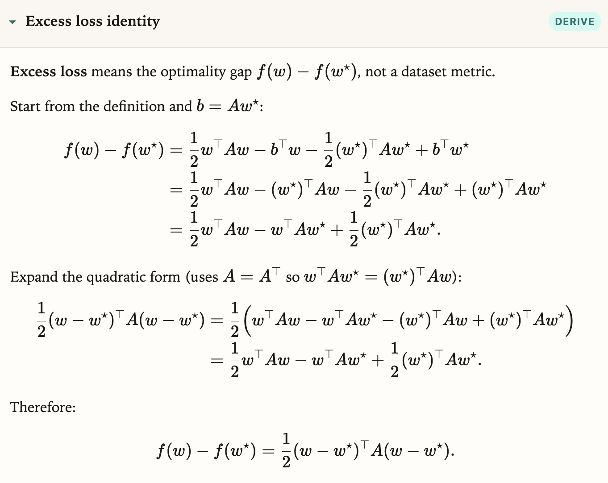

the function error is also convex and minimized at w = w*

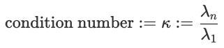

determines the rate of convergence, is a direct measure of pathological curvature

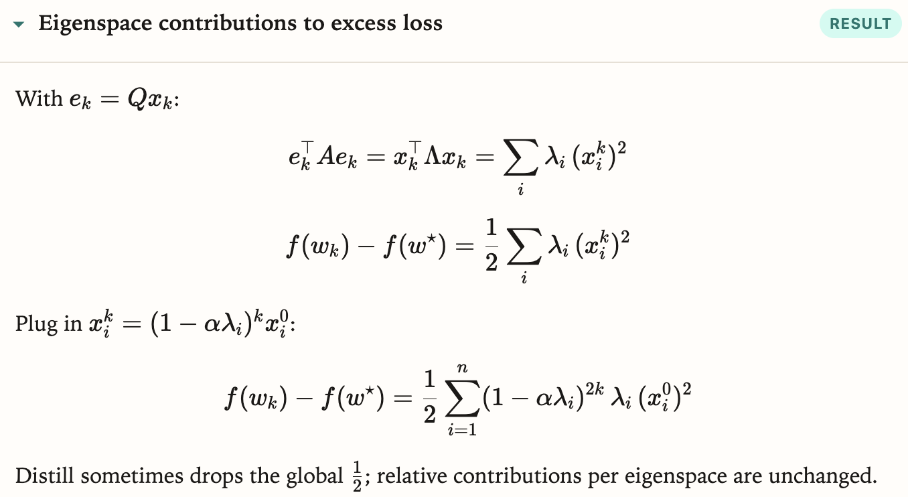

change bases for error → realize that the loss is the sum of losses over each eigendirection, squared by the eigenerrors

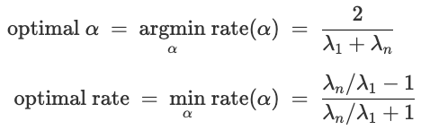

derived from setting the rates of convergence equal for each eigenvector5

1. Another example: polynomial regression
    - we can transform the weights to be expressed in the eigenbasis
    
    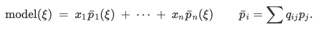
    
    each new p is the projection of the old p’s into the eigenbasis (to change coordinates)
    
    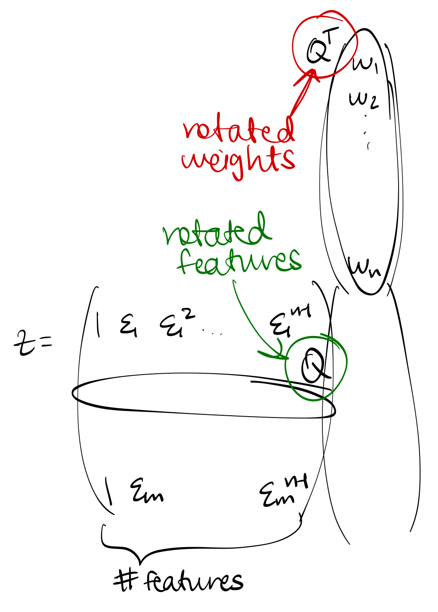
    
    we can write Zw = (ZQ)\cdot (Q^Tw)
    
    - now the behavior of the x_i's is more understandable than the w_i's because each coordinate behaves independently of another
    - for ZQ, each column represents the impression that an eigenvector has on all the data (each row is a different data point)
    - Q^Tw represents the new weights we want to optimize, and they represent how important each eigendirection is to capture the pattern in the data
    - can use early stopping to achieve the same effects as ridge (Tikhonov) regression—with regular SGD, the stopping doesn’t allow the smaller eigendirections to overfit to the data
        
        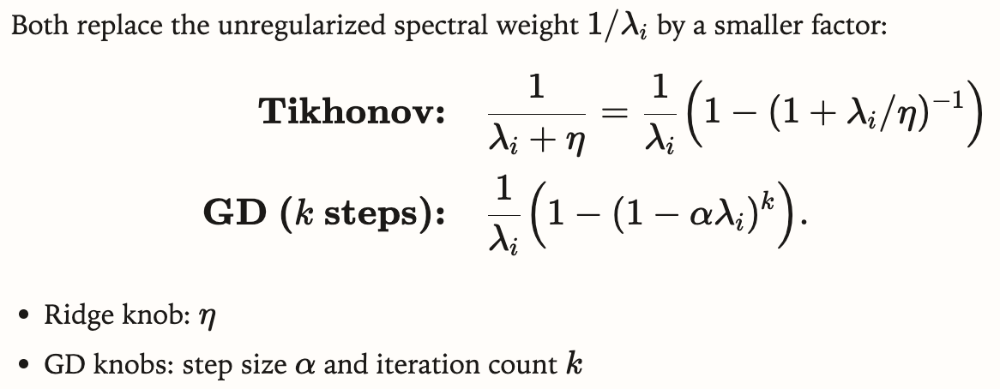
        
2. Switching to momentum
    
    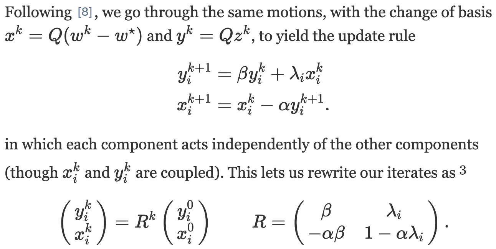
    
    - the convergence rate is determined by the larger eigenvalue (in absolute value)
    - under certain conditions, the eigenvalues are complex and the convergence rate is independent of alpha and eigenvalues—it only depends on beta
3. The Critical Damping Coefficient
    
    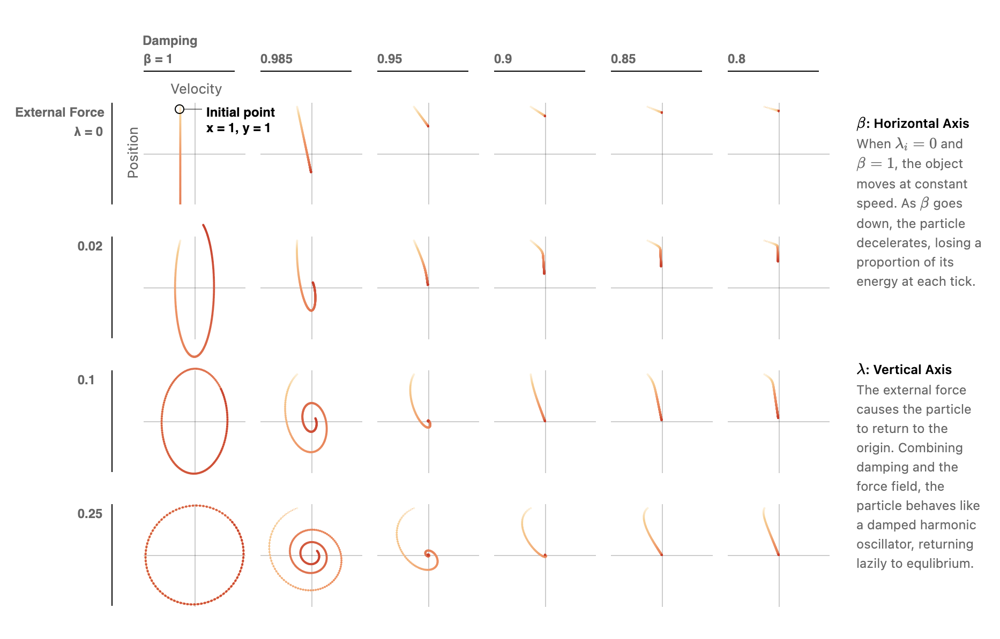
    
    phase diagram approximately representing the movement of a spring
    
    - there’s both a component that maintains velocity (beta) and provides a restoring force (gradient)
    
    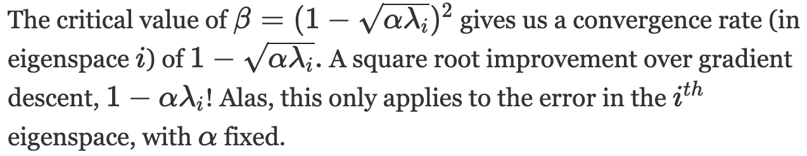
    
    - for multiple modes, we only have to look at the 2x2 matrices with the largest & smallest eigenvalues
        
        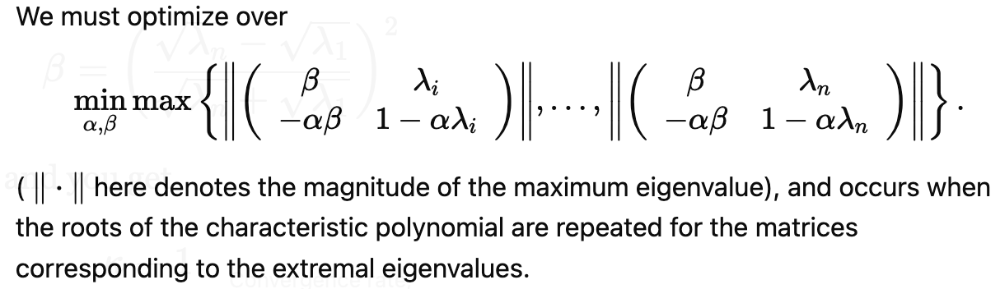
        
        there are many matrices, but we only need to look at 2 of them
        
        - there will be repeated roots in those quadratics and between those quadratics
        
        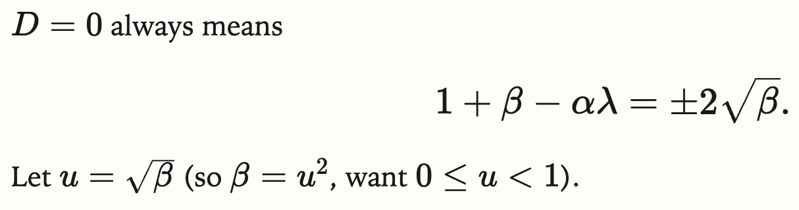
        
        the equation holds for alpha, beta, and the 2 different lamdas → we can solve for alpha and beta
        
        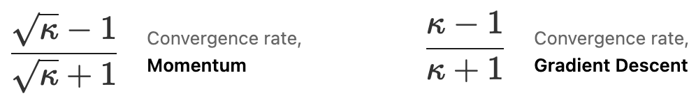
        
        decreasing the condition number is good!
        
    - for ill-conditioned problems, beta will be close to 1 → we initialize it as a high number
        - then, we find the largest $\alpha$ that allows for convergence
    - even tho we might find the optimal $\alpha$ and $\beta$, this only guarantees best long-term convergence rate, not ideal short-term behavior
- Example: The Colorization Problem
    - without momentum, all the updates are localized & act like drops of ink in water
    - can rewrite the optimization problem with matrices & vectors
    - Laplacian matrix $L_G$ connects lin alg & graph theory
        - conditioning of $L_G$ ↔ connectivity of the graph
            - poor connectivity (like linear graphs) → 1st order optimizations can’t overcome speed hurdles (👀)
- The Limits of Descent
    - both gradient descent and momentum can be “unrolled”
        
        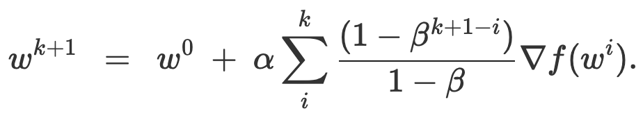
        
        unrolling momentum. past gradients have a lingering effect
        
    - all manner of first order algorithms, including the Conjugate Gradient algorithm, AdaMax, Averaged Gradient and more, can be written (though not quite so neatly) in this unrolled form
        
        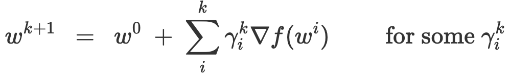
        
        general form
        
    - when allowing for different step sizes for different directions
        
        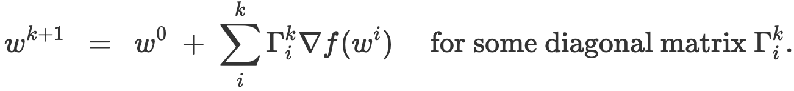
        
        covers ADAM and AdaGrad
        
    - Convex Rosenbrock
        
        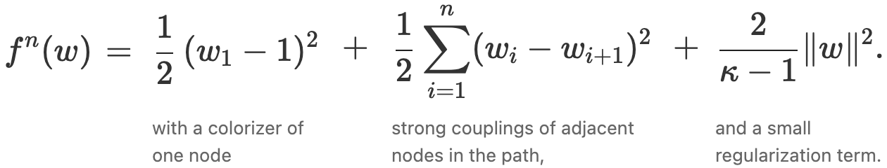
        
        as n → $\infty$, the condition number → $\kappa$
        
        - unfortunately this construction makes the lower bound of error asymptotically equal to the upper bound guaranteed by momentum → shows optimality
- Momentum with Stochastic Gradients
    - finding gradients is difficult → momentum includes an error term with EV = 0
    - updates are noisy
        
        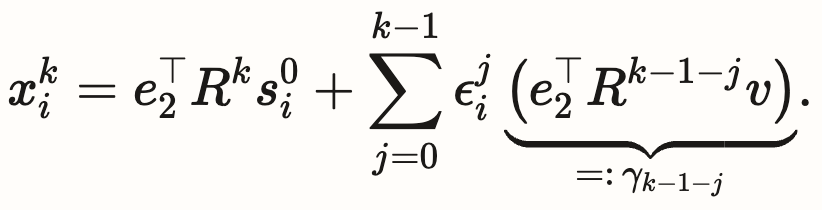
        
    - according to “On the importance of initialization and momentum in deep learning,” the transient phase seems to matter more than the fine-tuning phase in machine learning
    - noise acts as an implicit regularizer
- future directions: envisioning momentum as a discrete differential equation, approximating polynomials, geometry, ellipsoid method, duality, second-order methods

DOK2 Summary: When doing GD, it is easier to think of the gradient in the eigenbasis because each coordinate is independent of the others. We can express the weights in the eigenbasis and transform the features to match the new representation. In momentum, transforming into the eigenbasis gives us a closed-form formula for finding the updates and weights at every step. Using the constraint of keeping the eigenvalues less than 1, we can guarantee convergence for larger learning rates. Choosing the optimal alpha and beta requires difficult optimization, so the rates are often found empirically. Finally, all momentum techniques can be parameterized into a few equations, and using stochastic momentum introduces noise into the updates but can boost robustness.

**Source 2: https://arxiv.org/abs/1711.05101** (AdamW — Loshchilov & Hutter)

Related: Adam https://arxiv.org/abs/1412.6980

DOK1 Facts

- *(to fill)*
- Adam adapts per-parameter steps using running averages of the gradient and squared gradient
- AdamW decouples weight decay from the adaptive update (unlike L2 regularization inside Adam)
- AdamW is the usual default for LLM pretraining

DOK2 Summary: *(draft together)*

**Source 3: https://arxiv.org/abs/2502.16982** (Muon — Liu et al.)

DOK1 Facts

- *(to fill)*
- Muon = orthogonalized / spectral momentum-style optimizer for LLM training
- paper claims large compute-efficiency gains vs AdamW (prior until we measure on our harness)

DOK2 Summary: *(draft together)*

**Source 4: https://arxiv.org/abs/2101.03961** (MoE — Switch Transformers, Fedus et al.)

DOK1 Facts

- *(to fill)*
- Mixture-of-Experts routes each token to a subset of experts (sparse activation)
- can grow total parameters a lot while keeping per-token compute closer to activated experts only
- relevant to pretraining scale / FLOPs tradeoff, not just “pick an optimizer”

DOK2 Summary: *(draft together)*
